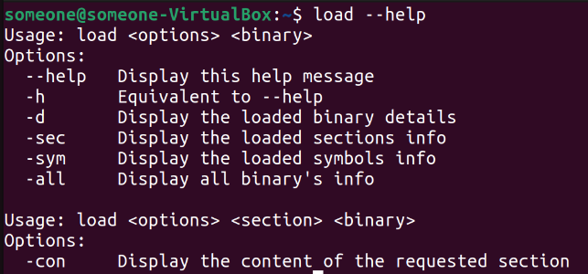

# **The_Binary_Loader**
## This is a Linux tool to load binary and show its details without running it.

Because nearly all analysis tools needs to parse and (statically) load binary files, it makes sense to have a common framework that provides this ability. In this program, I used **libbfd** to design and implement such a framework to reinforce what I’ve learned so far about binary formats. I also added a small terminal interface called **"load"** to make it easy to use.

**You’ll see the binary loading framework again in almost all of upcoming tools**

**Note** that this is completely different from the dynamic loader provided
by the OS, whose job it is to load binaries into memory to execute them

## **What Is libbfd?**
The Binary File Descriptor library (libbfd) provides a common interface
for reading and parsing all popular binary formats, compiled for a wide
variety of architectures. This includes ELF and PE files for x86 and x86-64
machines. By basing the binary loader on libbfd, we can automatically
support all these formats without having to implement any format-specific
support.
The BFD library is part of the GNU project and is used by many applications in the binutils suite, including objdump, readelf, and gdb. It provides
generic abstractions for all common components used in binary formats,
such as headers describing the binary’s target and properties, lists of sections, sets of relocations, symbol tables, and so on. On Ubuntu, libbfd is part
of the binutils-dev package.
You can find the core libbfd API in /usr/include/bfd.h.
## **prerequisites**
Install the **GNU project** (if not already installed), You can use these commands to do that:
```
sudo apt update
sudo apt install binutils-dev
```


## **How to install**
* **Automatic  Intstallation:**

        Open your linux terminal and run the following commands:
        ```
        chmod +x install.sh
        ./install.sh
        ```
        ---

* **Manual Installation:**
    1. Compile the **"loader_demo.cc"** file an link it with **"load.o"** with the flag **"-lbfd."**
    
        ```
        sudo g++ -std=c++11 -o load loader_demo.cc loader.o -lbfd
        ```
    2. Move the files **"bfd.h, loader.h, loader.o, load"** to the **"/usr/bin"** directory.
        ```
        sudo mv bfd.h loader.h loader.o load /usr/bin
        ```

## **Loader API**
At its core, the whole API centers around only two functions. 
1. **load_binary function**, which takes the name of a binary file to
load (fname), a pointer to a Binary object to contain the loaded binary (bin), and a descriptor of the binary type (type). It loads the requested binary into the bin parameter and returns an integer value of 0 if the loading process was successful or a value less than 0 if it was not successful
2. **unload_binary**, which simply takes a pointer to a previously
loaded Binary object and unloads it.

## **The "load" interface**
Besides the loader, I added a small terminal interface called **"load"** to make it easier to use. The load program can display some of the most important features of the loader like:
* Binary details
* Sections details
* sections content (raw data & ASCII representation)
* symbols details

If you want to display more, Use the [**bfd.h manual**](https://ftp.gnu.org/old-gnu/Manuals/bfd-2.9.1/html_mono/bfd.html) to implement it into the load program 


## **How to use**

There are 6 options in the interface:

1. 
    ```
    load --help
    ```

* Shows the help menu (equivalent to -h).
  
    

    ---


2. 
    ```
    load -d <Binary>
    ```

* Shows the details of the loaded binary.


    ---


3. 
    ```
    load -sec <Binary>
    ```

* Shows the  sections details of the loaded binary.


    ---


4. 
    ```
    load -sym <Binary>
    ```

* Shows the symbols details of the loaded binary.


    ---


5. 
    ```
    load -all <Binary>
    ```

* Shows all previous details of the loaded binary together.


    ---


6. 
    ```
    load -con <section_name> <Binary>
    ```

* Shows the row data of the mentioned section.


---
$~$
$~$
$~$


## **References/Resources**
* The  [Practical Binary Analysis](https://practicalbinaryanalysis.com/) book chapter 4
* [Binary File Descriptor Library](https://ftp.gnu.org/old-gnu/Manuals/bfd-2.9.1/html_mono/bfd.html) user-manual
